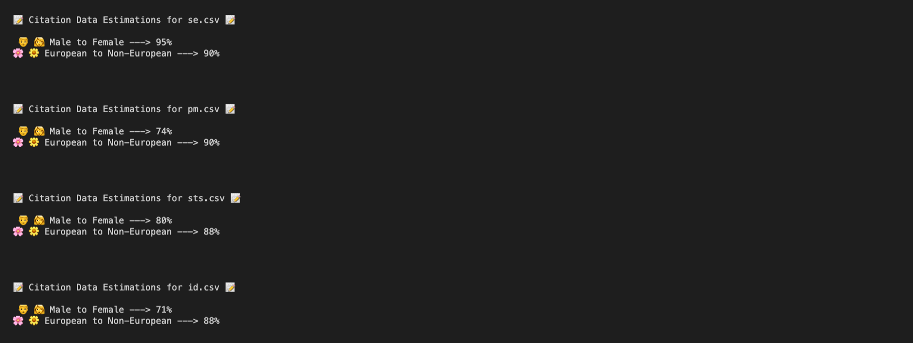

# Citations as Intersectional Feminist Bricks

I wrote a script to measure the ratio of women of colour authors on my university's bookshelf. We keep a record of all the books available in a google spreadsheet, so I just downloaded it and used NamSor to predict/classify the authors gender and ethnicity based on their name. Unfortunately this classification method is not the most accurate - but it is quick! - saved me from classifying 500+ rows by hand :3

Each booklist is randomly sampled from, as NamSor batching only supports up to 100 data points per request. Thus, these results change very slightly on every run of the script, but I have not seen fluctuations surpassing ~5% in any category in any department.

The original export is in the root folder, and I manually separated each book list by department. You can see the files inside the books directory. The results of passing each csv file inside /books to the NamSor API can be found inside /generated.

All the logic is inside src/index.ts.

This is the output of the script after running:

I never considered the importance of diversity in canonical literature/citational practices.
I grew up wanting to read through as many "classics" as I could because I was taught that the works most respected by those in academic institutions were of the highest quality.
I don't remember desiring to pick up any books by feminists of color in academia, or being encouraged to, which is what I would now consider a great shame.

Inspired by Sarah Ahmed, in Living a Feminist Life [2017 Duke University Press], she notes that:

> “Citations can be feminist bricks: they are the materials through which, from which, we create our dwellings.” [16]

Ahmed reminds me to consider more deeply how knowledge has been reproduced throughout history, and what categories of people those reproductions have benefited.
How have we been measuring contributions in scientific domains? What do we even consider to be a contribution?

I wanted to get some concrete information regarding how the bookshelf at my university fared in terms of gender and ethnicity.
What was the kind of information that it considered worthy of reproduction?
How diverse were the voices included on it's shelves?
What does that say about the university's commitment to diversity, if anything?

> “Commitments might even be made because they do not bring something about. Indeed, equality and diversity can be used as masks to create the appearance of being transformed.” [90]

I interpret this as the situation in which an institution is overly concerned with paper trails and image making, rather than actually doing the actions required to make an environment more accomodating for those that were not historically accomodated.

> ”...for those who do not have a sense of the racism or sexism you are talking about, to bring them up is to bring them into existence.” [37]

I was very hesitant to even codify something involving categories of gender and ethnicity for fear of being considered playing into identity politics. Ahmed eloquently notes that talking about a problem that others do not experience or know about is to pose a problem, and often to become a problem.
Speaking about sexism and racism is often conflated with being overly subjective, emotional, and even narcisstic. This is especially true in a time when terms like feminism and self-care have been appropriated and lost their original meaning as survival tactics involving collective caring, to denote some kind of justification for purchasing wildly over priced beauty products.

> “Diversity work is pushy work because you have to push against what has already been built. We have to make adjustments to an existing arrangement in order to open institutions to those who have been historically excluded by them.” [109]

Organizations consistently fail to think about access for a diverse range of bodies - ramps for wheel chairs, podiums, timetables for people with children. Even the furniture makes assumptions about bodies and what they do [110]. The physical environment becomes one kind of invitation for certain bodies to pass through the institution, and citational practices - whose work is studied in an institution - can become a similar kind of invitation, or wall - depending on which category you fall into.

> "I think as feminists we can hope to create a crisis around citation, even just a hestitation, a wondering, that might help us not to follow the well-trodden citational paths." [148]

And my favourite quote of the whole book:

> "We need structure to give evidence of structure.” [30]

## Setup

`npm install`

`npm run dev`

`npm run prod`

### Requires .env in root folder with the following keys:

`API_KEY=`

`GENDER_ENDPOINT=`

`ETHNICITY_ENDPOINT=`

#### These can be obtained from namsor:

https://v2.namsor.com/NamSorAPIv2/apidoc.html

Unfortunately they rate limit you after 500 classifications of origin/ethnicity and 5000 classifications of gender... meaning running this script more than twice with the ethnicity classifications will cease to work...
It would be great to turn this into a tiny web app where people can similarly upload a csv of the authors on their syllabus or on their university bookshelves to gauge how diverse the perspectives being circulated are :)
